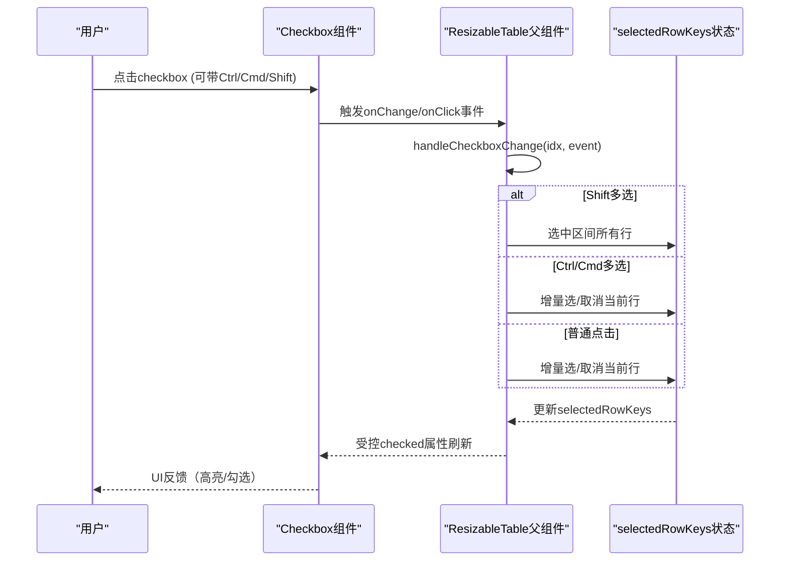
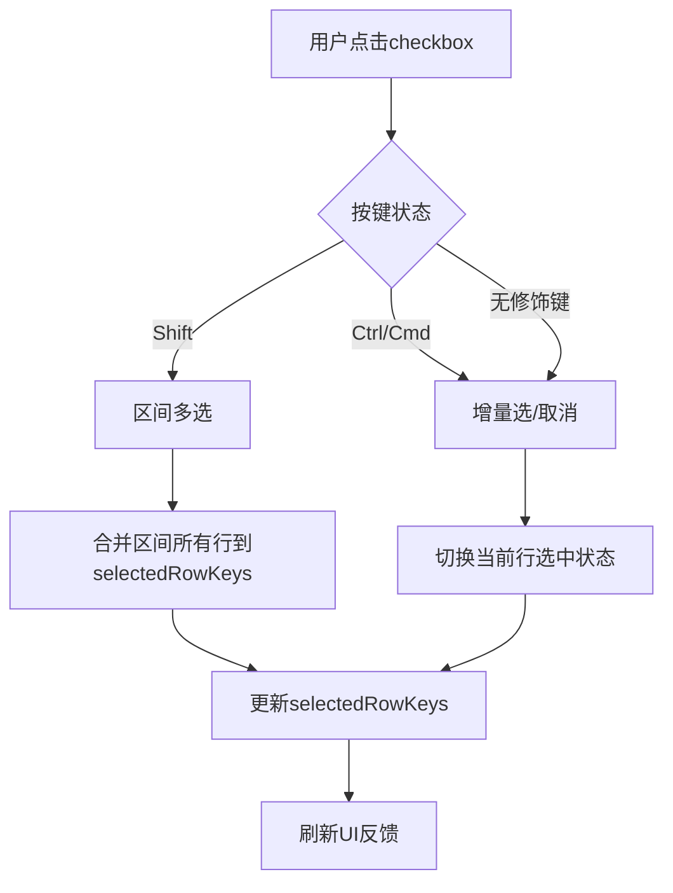
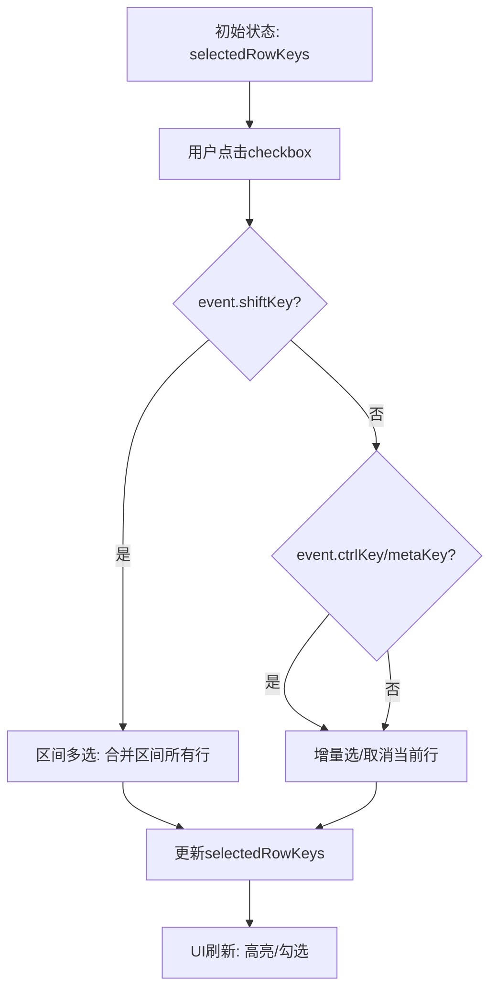
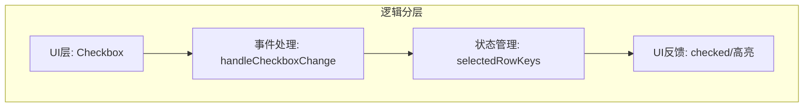
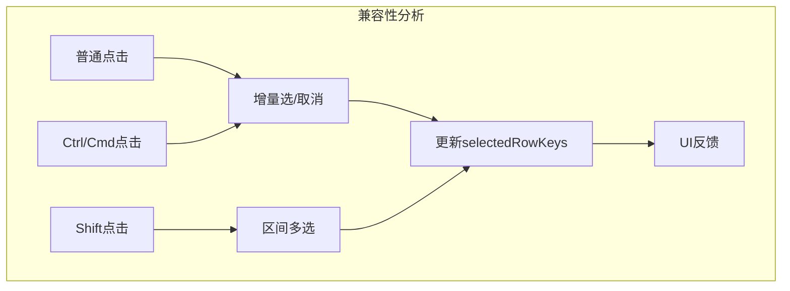

# FilePane 多选交互设计文档

## 1. 设计问题详尽分析

- 如何让 checkbox 的点击行为既支持增量选择/取消，又与 Ctrl/Cmd/Shift 组合键兼容？
- 如何保证 UI 反馈（高亮、勾选）与 selectedRowKeys 状态完全同步？
- 如何避免"单选"误操作，确保用户每次点击都能直观地增减选中项？
- 如何兼容主流文件管理器的多选体验（如 Windows Explorer、macOS Finder）？
- 事件处理与状态流转：事件入口、分流、状态变更、UI反馈
- 边界与异常场景：lastSelected 未定义、重复点击、与拖拽/排序兼容性

---

## 2. 多选交互序列图

**说明：** 展示用户点击 checkbox 后，事件如何在组件间流转，如何根据组合键决定多选逻辑。

---

## 3. 多选逻辑流程图

**说明：** 展示多选逻辑的分支与状态流转。

---

## 4. 状态流转与分支判定图

**说明：** 详细描述事件分支与状态更新的判定过程。

---

## 5. 逻辑分层图

**说明：** 展示 UI、事件处理、状态管理、UI反馈的分层关系。

---

## 6. 兼容性分析图

**说明：** 展示不同操作方式（普通、Ctrl/Cmd、Shift）下的兼容性与状态流转。

