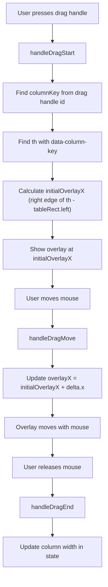
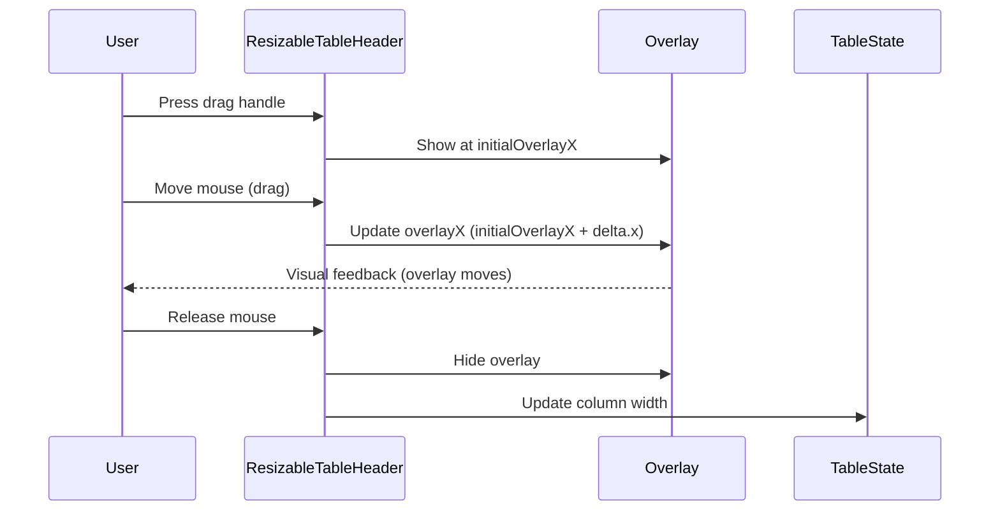

# ResizableTable DESIGN.md

## Overview

The `ResizableTable` component provides a robust, user-friendly way to resize table columns with immediate visual feedback. It is designed to work seamlessly with Ant Design tables, handling edge cases like selection columns and dynamic column order.

---

## Key Design Points

- **Unique Column Keys:** Each data column header cell (`<th>`) is given a unique `data-column-key` attribute matching the column's key.
- **Drag Handles:** The drag handle is rendered only for columns that can be resized (not the last column), and only if `columnKey` is defined.
- **Overlay Rendering:** The overlay is rendered as an absolutely positioned sibling to the table, inside a wrapper with `position: relative`.
- **Overlay Positioning:** Overlay position is calculated by matching the `columnKey` to the correct th using `data-column-key`, and using the right edge of that cell relative to the wrapper.
- **Drag Feedback:** All overlay movement is based on the initial right edge plus the drag delta, ensuring the overlay always matches the column edge.
- **No Portals into AntD Internals:** The overlay is not rendered inside AntD's internal containers, avoiding layout breakage.

---

## Flow Diagram (Mermaid)

---

## Sequence Diagram (Mermaid)

---

## Issues Encountered & Solutions

- **Off-by-one errors:** Caused by extra th elements (e.g., for selection) that do not correspond to data columns. **Fixed by using `data-column-key` and matching by key, not index.**
- **Overlay misalignment:** **Fixed by always using the correct th and wrapper for position calculations.**
- **`findIndex` returning -1:** Caused by mismatches between drag handle id and column key, or missing/undefined keys. **Fixed by ensuring all data columns have unique string keys and drag handles use the correct id.**
- **Overlay breaking table layout:** **Avoided by not using portals into AntD internals, but instead rendering overlay as a sibling in a controlled wrapper.**

---

## Result

This design is robust to extra header cells, selection columns, and dynamic column order, and ensures the overlay always matches the correct column edge.

---

## Example: Overlay Position Calculation

- On drag start, find the th with `data-column-key` matching the column being resized.
- Get its bounding rect and the wrapper's bounding rect.
- `initialOverlayX = thRect.right - wrapperRect.left + scrollLeft`
- On drag move, update overlay position: `overlayX = initialOverlayX + delta.x`

---

## Future Improvements

- Add double-click to auto-size column to fit content.
- Support min/max column widths.
- Add keyboard accessibility for resizing.
- Animate overlay for smoother feedback.
